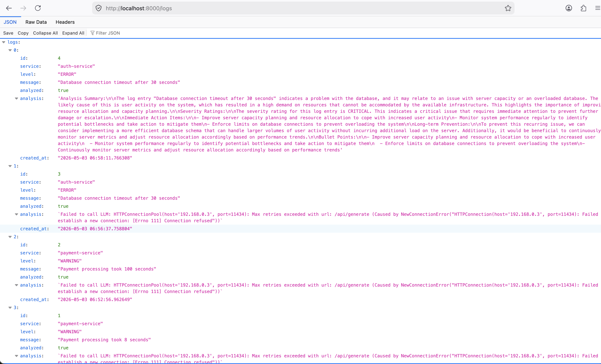
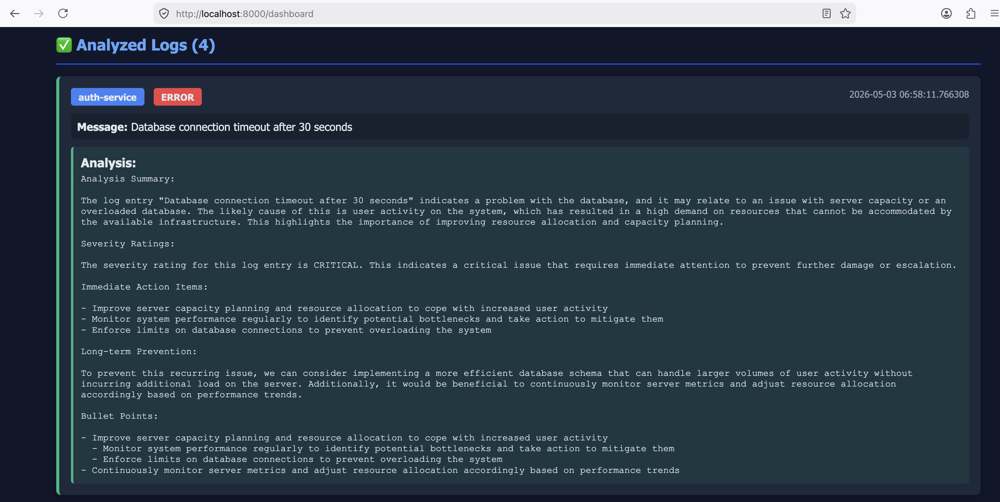

# AI Log Analyzer

[](https://docker.com)
[](https://python.org)
[](https://fastapi.tiangolo.com)
[](https://postgresql.org)
[](https://jenkins.io)
[](https://ollama.ai)

A scalable, containerized microservices application for intelligent log analysis using AI-powered insights. Built to handle high-volume log ingestion from distributed systems, this project demonstrates expertise in full-stack development, DevOps practices, and AI integration.

## 🚀 Key Highlights

- **Microservices Architecture**: Modular design with separate API and worker services for scalability
- **AI-Powered Analysis**: Leverages Large Language Models (LLM) via Ollama for automated root cause analysis and recommendations
- **Production-Ready**: Complete CI/CD pipeline with Jenkins, multi-architecture Docker builds, and automated testing
- **Database-Driven**: Robust PostgreSQL backend with optimized queries and indexing
- **Asynchronous Processing**: Efficient batch processing of logs to handle high throughput
- **Containerized Deployment**: Docker Compose setup for easy local development and production deployment

## 📋 Table of Contents

- [Project Overview](#project-overview)
- [System Architecture](#system-architecture)
- [Technologies Used](#technologies-used)
- [Key Features](#key-features)
- [Prerequisites](#prerequisites)
- [Installation & Setup](#installation--setup)
- [API Documentation](#api-documentation)
- [CI/CD Pipeline](#cicd-pipeline)
- [Testing](#testing)
- [Development Guide](#development-guide)
- [Troubleshooting](#troubleshooting)
- [Contributing](#contributing)
- [License](#license)

---

## 📖 Project Overview

**AI Log Analyzer** is an enterprise-grade solution designed to streamline log management and analysis for modern distributed systems. The application ingests logs from multiple microservices via RESTful APIs, stores them in a PostgreSQL database, and employs AI to generate actionable insights on system health, errors, and performance issues.

This project showcases advanced software engineering skills including:
- Designing and implementing microservices architectures
- Integrating AI/ML capabilities into backend systems
- Building robust CI/CD pipelines for automated deployment
- Ensuring high availability and scalability through containerization
- Implementing comprehensive testing strategies

#### Screenshot: JSON response from `/logs`


This screenshot shows the `/logs` endpoint response in a browser, including analyzed log entries with: `id`, `service`, `level`, `message`, `analyzed` status, `analysis` text, and `created_at` timestamp. It demonstrates how the API returns structured log insights and AI-generated analysis in JSON format.

#### Screenshot: Visual dashboard for analyzed logs at `/dashboard`


This screenshot shows the `/dashboard` UI view, where each analyzed log is displayed as a card with service tags, a red error severity badge, the original message, and rich AI analysis content. It highlights the operational monitoring experience and how AI insights are surfaced visually for fast troubleshooting.

### 🎯 Problem Solved

In complex distributed systems, manual log analysis is time-consuming and error-prone. This application automates the process by:
1. Centralizing log collection from multiple services
2. Applying AI-driven analysis to identify root causes
3. Providing structured recommendations for issue resolution
4. Enabling proactive system monitoring and maintenance

---

## 🏗️ System Architecture

```
┌─────────────────┐         ┌──────────────────┐         ┌─────────────────┐
│   Microservices │         │   API Service    │         │   PostgreSQL    │
│   (Log Sources) ├────────►│   (FastAPI)      ├────────►│   Database      │
└─────────────────┘         └──────────────────┘         └─────────────────┘
                                   ▲                           │
                                   │                           │
                                   │ (Polls every 10s)        │
                                   ▼                           ▼
                            ┌──────────────────┐         ┌─────────────────┐
                            │   Worker Service │         │   Analysis      │
                            │   (AI Analyzer)  │◄────────┤   Results       │
                            └──────────────────┘         └─────────────────┘
                                   │
                                   ▼
                            ┌──────────────────┐
                            │   Ollama LLM     │
                            │   (tinyllama)    │
                            └──────────────────┘
```

### Component Breakdown

#### 🔌 API Service (FastAPI)
- **Purpose**: RESTful endpoint for log ingestion and retrieval
- **Technology**: FastAPI with Uvicorn ASGI server
- **Features**: Automatic API documentation, request validation, health checks
- **Port**: 8000

#### ⚙️ Worker Service (Python)
- **Purpose**: Asynchronous log processing and AI analysis
- **Technology**: Pure Python with psycopg2 and requests
- **Features**: Batch processing (up to 5 logs), retry logic, structured AI prompts
- **Integration**: Ollama API for LLM-powered analysis

#### 🗄️ PostgreSQL Database
- **Purpose**: Persistent storage for logs and analysis results
- **Features**: Indexed queries, health checks, data durability
- **Schema**: Optimized tables with metadata tracking

#### 🤖 AI Analysis Engine
- **Model**: TinyLlama via Ollama
- **Capabilities**: Root cause analysis, severity assessment, actionable recommendations
- **Prompt Engineering**: Structured prompts for consistent, professional insights

---

## 🛠️ Technologies Used

### Backend & APIs
- **Python 3.11**: Core programming language
- **FastAPI**: Modern, high-performance web framework
- **Uvicorn**: ASGI server for FastAPI
- **psycopg2**: PostgreSQL database adapter

### Database
- **PostgreSQL 15**: Robust relational database
- **Database Indexing**: Optimized query performance

### AI & ML
- **Ollama**: Local LLM runtime
- **TinyLlama**: Lightweight language model for analysis

### DevOps & Deployment
- **Docker**: Containerization platform
- **Docker Compose**: Multi-container orchestration
- **Jenkins**: CI/CD automation
- **Multi-architecture Builds**: Support for AMD64 and ARM64

### Testing
- **pytest**: Python testing framework
- **Integration Tests**: End-to-end service validation
- **Health Checks**: Automated service monitoring

### Development Tools
- **Git**: Version control
- **Makefile**: Build automation
- **Shell Scripting**: Deployment scripts

---

## ✨ Key Features

- **🔄 Asynchronous Processing**: Non-blocking log analysis with background workers
- **📊 Structured AI Insights**: Consistent analysis format with severity ratings and recommendations
- **🏗️ Scalable Architecture**: Microservices design supporting horizontal scaling
- **🔍 Intelligent Filtering**: Database indexing for efficient log retrieval
- **🛡️ Health Monitoring**: Built-in health checks for all services
- **📦 Containerized Deployment**: One-command setup with Docker Compose
- **🔄 CI/CD Integration**: Automated testing, building, and deployment via Jenkins
- **📈 Performance Optimized**: Batch processing and connection pooling
- **🔐 Secure Configuration**: Environment-based credential management

---

## 📋 Prerequisites

- **Docker** (v20.10+) - Container runtime
- **Docker Compose** (v1.29+) - Multi-container orchestration
- **Git** - Version control system
- **Python 3.11** (optional, for local development)
- **Ollama** (optional, for local AI testing)

### System Requirements
- 4GB RAM minimum (8GB recommended)
- 10GB free disk space
- Linux/Windows/macOS with Docker support

---

## 🚀 Installation & Setup

### Quick Start with Docker Compose

1. **Clone the repository**
   ```bash
   git clone <repository-url>
   cd ai-log-analyzer
   ```

2. **Start all services**
   ```bash
   docker-compose up -d
   ```

3. **Verify deployment**
   ```bash
   docker-compose ps
   ```

4. **Check API health**
   ```bash
   curl http://localhost:8000/health
   ```

### Manual Setup (Development)

1. **Install dependencies**
   ```bash
   # API service
   cd api
   pip install -r requirements.txt

   # Worker service
   cd ../worker
   pip install -r requirements.txt
   ```

2. **Start PostgreSQL**
   ```bash
   docker run -d --name postgres \
     -e POSTGRES_USER=admin \
     -e POSTGRES_PASSWORD=admin \
     -e POSTGRES_DB=logsdb \
     -p 5432:5432 postgres:15
   ```

3. **Run services**
   ```bash
   # Terminal 1: API
   cd api
   uvicorn main:app --host 0.0.0.0 --port 8000

   # Terminal 2: Worker
   cd worker
   python worker.py
   ```

---

## 📚 API Overview

The service exposes a small REST API for log ingestion and retrieval:
- `POST /logs`: submit an application log entry
- `GET /logs`: retrieve logs and analysis results
- `GET /dashboard`: view analyzed logs in the web UI
- `GET /health`: verify service availability

For full endpoint details and request examples, see `api/main.py`.

## 🔄 CI/CD Pipeline

A Jenkins pipeline automates build, test, and optional multi-architecture Docker image publishing. It supports:
- parameterized builds
- Docker buildx for `amd64` + `arm64`
- webhook-triggered runs
- automated integration testing

See `docs/CICD_PIPELINE.md` and `docs/JENKINS_SETUP.md` for full implementation details.

## 🧪 Testing

Run the integration suite:
```bash
cd tests
pip install -r requirements.txt
python test_api.py
```

Key coverage includes API health, log ingestion, retrieval, and worker processing.

## 💻 Development Guide

Project structure:
```
ai-log-analyzer/
├── api/         # FastAPI service
├── worker/      # AI analysis worker
├── tests/       # Integration tests
├── docs/        # Documentation and setup guides
└── docker-compose.yml
```

Local environment variables are defined in `docker-compose.yml` and can be overridden via `.env`.

## 🔧 Troubleshooting

Common issues are covered in `docs/CICD_PIPELINE.md` and `api/main.py`.

- Database connection failures
- API startup errors
- Worker analysis failures
- Jenkins build issues

---

## 🤝 Contributing

Contributions are welcome! This project demonstrates collaborative development practices.

### Development Workflow
1. Fork the repository
2. Create a feature branch: `git checkout -b feature/your-feature`
3. Make changes and add tests
4. Run tests: `python tests/test_api.py`
5. Commit and push your branch
6. Open a Pull Request

### Code Standards
- Follow PEP 8
- Add type hints for public code
- Include docstrings where appropriate
- Write tests for new functionality
- Update documentation as needed

---

## 📄 License
Not Applicable
---

## 👤 Author

**Pawan Kumar Ambust**  
*Full-Stack Developer | DevOps Engineer | AI Enthusiast*

- LinkedIn: [pawan-a-86887930](https://www.linkedin.com/in/pawan-a-86887930/)
- GitHub: [paambust](https://github.com/paambust)
- Email: ambust.pawan@gmail.com

*This project showcases expertise in modern software development, from concept to production deployment.*

---


```

---

## Installation & Setup

### 1. Clone the Repository

```bash
git clone https://github.com/yourusername/ai-log-analyzer.git
cd ai-log-analyzer
```

### 2. Configure Environment Variables

Create or update `.env` file (optional for defaults):

```env
# Database Configuration
DB_HOST=postgres
DB_PORT=5432
DB_USER=admin
DB_PASSWORD=admin
DB_NAME=logsdb

# API Configuration
API_PORT=8000
API_HOST=0.0.0.0

# LLM Configuration
LLM_API_KEY=your_api_key_here
LLM_MODEL=gpt-4
LLM_ENDPOINT=https://api.openai.com/v1
```

### 3. Build and Start Services

```bash
# Build images and start all services
sudo docker-compose up -d --build

# Verify containers are running
sudo docker-compose ps
```

Expected output:
```
NAME              STATUS              PORTS
postgres          Up X seconds        0.0.0.0:5432->5432/tcp
api-service       Up X seconds        0.0.0.0:8000->8000/tcp
worker-service    Up X seconds        (no ports)
```

---

## Quick Start

### 1. Start Ollama (One-time Setup)

```bash
# Install Ollama (if not already installed)
curl -fsSL https://ollama.com/install.sh | sh

# Download the model (one-time)
ollama pull tinyllama

# Start Ollama server
OLLAMA_HOST=0.0.0.0:11434 ollama serve
```

### 2. Start Docker Services

```bash
cd ai-log-analyzer
sudo docker-compose up -d --build
```

### 3. Send a Test Log

```bash
curl -X POST http://localhost:8000/logs \
  -H "Content-Type: application/json" \
  -d '{
    "service": "my-service",
    "level": "ERROR",
    "message": "Database connection timeout after 30 seconds"
  }'
```

### 4. View Results

**Option A: JSON API (5-30 seconds for LLM to respond)**
```bash
sleep 20  # Wait for worker to process
curl http://localhost:8000/logs?analyzed=true | jq '.logs[0].analysis'
```

**Option B: Visual Dashboard**
Open in browser: `http://localhost:8000/dashboard`

**Option C: Watch Worker Logs**
```bash
sudo docker-compose logs -f worker
```

---

## Database Schema

### Logs Table

The `logs` table stores all incoming log records and their analysis status.

```sql
CREATE TABLE logs (
    id SERIAL PRIMARY KEY,
    service TEXT,
    level TEXT,
    message TEXT,
    analyzed BOOLEAN DEFAULT FALSE,
    analysis TEXT,
    created_at TIMESTAMP DEFAULT CURRENT_TIMESTAMP
);
```

#### Column Descriptions

| Column | Type | Description |
|--------|------|-------------|
| `id` | SERIAL | Auto-incrementing unique identifier |
| `service` | TEXT | Name of the service sending the log (e.g., "auth-service", "api-gateway") |
| `level` | TEXT | Log severity level (INFO, WARNING, ERROR, CRITICAL, DEBUG) |
| `message` | TEXT | The actual log message content |
| `analyzed` | BOOLEAN | Flag indicating if log has been analyzed (default: FALSE) |
| `analysis` | TEXT | AI-generated analysis/insights (NULL if not yet analyzed) |
| `created_at` | TIMESTAMP | Server timestamp when log was received |

### Create the Table

After starting the services, connect to the database and create the table:

```bash
# Access the PostgreSQL container
sudo docker exec -it postgres sh

# Connect to the database
psql -U admin -d logsdb

# Create the table
CREATE TABLE logs (
    id SERIAL PRIMARY KEY,
    service TEXT,
    level TEXT,
    message TEXT,
    analyzed BOOLEAN DEFAULT FALSE,
    analysis TEXT,
    created_at TIMESTAMP DEFAULT CURRENT_TIMESTAMP
);

# Verify table creation
\dt

# Exit
\q
exit
```

---

## API Documentation

### Base URL

```
http://localhost:8000
```

### Endpoints

#### 1. Health Check

**Endpoint:** `GET /health`

**Purpose:** Verify API service is running and healthy.

**Response:**
```json
{
    "status": "ok"
}
```

**Example:**
```bash
curl http://localhost:8000/health
```

---

#### 2. Create Log Entry

**Endpoint:** `POST /logs`

**Purpose:** Submit a new log for storage and analysis.

**Request Body:**
```json
{
    "service": "auth-service",
    "level": "ERROR",
    "message": "Failed to authenticate user: token expired"
}
```

**Required Fields:**
- `service` (string): Service name
- `level` (string): Log level
- `message` (string): Log message

**Response:**
```json
{
    "status": "stored"
}
```

**HTTP Status Codes:**
- `200 OK`: Log successfully stored
- `400 Bad Request`: Missing or invalid fields
- `500 Internal Server Error`: Database connection failed

**Example:**
```bash
curl -X POST http://localhost:8000/logs \
  -H "Content-Type: application/json" \
  -d '{
    "service": "payment-service",
    "level": "WARNING",
    "message": "Payment processing took 8 seconds"
  }'
```

---

#### 3. Retrieve Logs with Analysis

**Endpoint:** `GET /logs`

**Purpose:** Retrieve stored logs with optional filtering by analysis status.

**Query Parameters:**
- `analyzed` (boolean, optional): Filter by analysis status (true/false)
- `limit` (integer, optional): Max results to return (default: 10)

**Response:**
```json
{
    "logs": [
        {
            "id": 1,
            "service": "database-service",
            "level": "ERROR",
            "message": "Connection pool exhausted: 50/50 connections active",
            "analyzed": true,
            "analysis": "Issue Summary: Database connection exhaustion...",
            "created_at": "2026-04-26 14:33:21.882510"
        }
    ]
}
```

**Examples:**
```bash
# Get last 10 logs (all statuses)
curl http://localhost:8000/logs

# Get only analyzed logs
curl "http://localhost:8000/logs?analyzed=true"

# Get only unanalyzed logs
curl "http://localhost:8000/logs?analyzed=false"

# Get last 5 analyzed logs
curl "http://localhost:8000/logs?analyzed=true&limit=5"

# Format JSON output
curl http://localhost:8000/logs?analyzed=true | jq '.logs[0]'
```

---

#### 4. Visual Dashboard

**Endpoint:** `GET /dashboard`

**Purpose:** Browse logs and analysis results in an interactive HTML dashboard.

**Features:**
- Dark-themed UI with responsive design
- Displays analyzed logs with full AI analysis
- Shows logs being processed in real-time
- Auto-refreshes every 10 seconds
- Color-coded log levels (ERROR, WARNING, INFO, etc.)
- Service badges for easy filtering

**Access:**
```
http://localhost:8000/dashboard
```

**Screenshot:**
- Green cards: Completed analyses with LLM insights
- Orange cards: Logs currently being analyzed by worker
- Real-time updates without manual refresh

---

### API Implementation Details

**File:** `api/main.py`

- Uses **FastAPI** framework for async request handling
- Connects to PostgreSQL using **psycopg2** library
- Connection pooling could be added for production
- Currently uses direct inserts; consider adding transaction handling

---

## Worker Service

### Overview

The Worker Service is a long-running background process that performs asynchronous log analysis using a local LLM (Ollama).

**File:** `worker/worker.py`

### Workflow

```
1. Connect to PostgreSQL database
2. Poll every 10 seconds for unanalyzed logs (LIMIT 5)
3. For each log:
   - Extract log ID, service, level, and message
   - Call Ollama LLM (tinyllama) API with structured prompt
   - Receive AI-generated analysis with root cause, severity, actions
   - Format analysis into readable format
4. Update logs table:
   - Set analyzed = TRUE
   - Store analysis result
5. Repeat
```

### Current Implementation

```python
# Polling frequency
time.sleep(10)  # Checks database every 10 seconds

# Batch size
LIMIT 5  # Processes up to 5 logs per cycle

# LLM Integration
# Calls: POST http://OLLAMA_HOST:11434/api/generate
# Model: tinyllama
# Response: Structured analysis with 5 sections
```

### LLM Analysis Structure

The worker generates analysis with:

1. **Issue Summary** - What problem does the log indicate?
2. **Root Cause Analysis** - What likely caused this?
3. **Severity Rating** - CRITICAL | HIGH | MEDIUM | LOW
4. **Immediate Actions** - What should be done right now? (bullet points)
5. **Long-term Prevention** - How to prevent recurring? (bullet points)

### Ollama Setup

The worker connects to Ollama running on the local machine.

**Install Ollama:**
```bash
# macOS / Linux
curl -fsSL https://ollama.com/install.sh | sh

# Or download from: https://ollama.com/download
```

**Pull Tinyllama Model:**
```bash
ollama pull tinyllama
```

**Start Ollama Server:**
```bash
# Default port: 11434
OLLAMA_HOST=0.0.0.0:11434 ollama serve
```

**Verify Connection:**
```bash
curl http://localhost:11434/api/generate \
  -X POST \
  -d '{
    "model": "tinyllama",
    "prompt": "Hello",
    "stream": false
  }'
```

### Production Considerations

1. **Alternative LLM Services:**
   - OpenAI (GPT-4, GPT-3.5-turbo)
   - Azure OpenAI
   - Anthropic Claude
   - Local models via llama.cpp

2. **Error Handling:** Already implemented with try-catch blocks

3. **Logging:** Add structured logging for debugging

4. **Scaling:** Run multiple worker instances for higher throughput

5. **Timeout Management:** Currently 60 seconds per LLM call

---

## Environment Configuration

### Database Environment Variables

These are set in `docker-compose.yml` and passed to containers:

```yaml
environment:
  DB_HOST: postgres          # Hostname (service name in Docker)
  DB_PORT: 5432             # PostgreSQL default port
  DB_USER: admin            # Database username
  DB_PASSWORD: admin        # Database password (CHANGE IN PRODUCTION!)
  DB_NAME: logsdb           # Database name
```

### Ollama Integration

The worker requires Ollama running on your local machine (not in Docker).

**Environment Setup:**
```bash
# Start Ollama on the host machine
OLLAMA_HOST=0.0.0.0:11434 ollama serve &

# Verify it's accessible
curl http://localhost:11434/api/generate -X POST -d '{"model":"tinyllama","prompt":"test","stream":false}'
```

**Worker Configuration:**
- **Ollama Host:** `http://192.168.0.3:11434` (update with your IP)
- **Model:** `tinyllama`
- **Temperature:** 0.3 (deterministic output)
- **Timeout:** 60 seconds per request

### Service-Specific Variables

**Worker Service:**
```yaml
# No API key needed for local Ollama
# For cloud LLMs, configure:
LLM_API_KEY: your_api_key_here
LLM_ENDPOINT: https://api.openai.com/v1  # For OpenAI, etc.
```

### Changing Credentials

**⚠️ Security Warning:** Default credentials are for development only.

To change database credentials:

1. Update `docker-compose.yml`:
   ```yaml
   postgres:
     environment:
       POSTGRES_USER: your_username
       POSTGRES_PASSWORD: your_password  # Use strong password!
       POSTGRES_DB: your_database
   ```

2. Rebuild and restart:
   ```bash
   sudo docker-compose down -v  # Remove old data
   sudo docker-compose up -d --build
   ```

---

## Running the Application

### Prerequisites: Start Ollama

Before starting Docker containers, start Ollama on your host machine:

```bash
# Terminal 1: Start Ollama server
OLLAMA_HOST=0.0.0.0:11434 ollama serve

# Terminal 2: Verify Ollama is running
curl http://localhost:11434/api/generate -X POST -d '{"model":"tinyllama","prompt":"test","stream":false}'
```

### Start All Services

```bash
# Build and start (development mode)
sudo docker-compose up -d --build

# View logs
sudo docker-compose logs -f

# View specific service logs
sudo docker-compose logs -f api
sudo docker-compose logs -f worker
sudo docker-compose logs -f postgres
```

### Test the System

**1. Send a test log:**
```bash
curl -X POST http://localhost:8000/logs \
  -H "Content-Type: application/json" \
  -d '{
    "service": "auth-service",
    "level": "ERROR",
    "message": "Database connection timeout after 30 seconds"
  }'
```

**2. Watch worker analyze (in real-time):**
```bash
sudo docker-compose logs -f worker
```

**3. Check results via API:**
```bash
# Wait 20-30 seconds for LLM to process
curl http://localhost:8000/logs?analyzed=true | jq '.logs[0]'
```

**4. View in browser dashboard:**
```
http://localhost:8000/dashboard
```

### Stop All Services

```bash
sudo docker-compose down
```

### Remove All Data and Containers

```bash
# Stop and remove containers, volumes, data
sudo docker-compose down -v

# This will delete the pgdata volume!
```

### View Individual Service Logs

```bash
# API service logs (with timestamps)
sudo docker-compose logs api --timestamps

# Worker service logs (real-time)
sudo docker-compose logs -f worker

# Database logs
sudo docker-compose logs postgres

# Follow API logs with tail
sudo docker-compose logs -f api --tail 50
```

### Access PostgreSQL Directly

```bash
# Interactive shell
sudo docker exec -it postgres sh

# Inside container, connect to database
psql -U admin -d logsdb

# List tables
\dt

# View logs table structure
\d logs

# Query logs
SELECT * FROM logs;
SELECT * FROM logs WHERE analyzed = FALSE;
SELECT * FROM logs WHERE level = 'ERROR';
SELECT id, service, level, short_message FROM logs LIMIT 5;

# Exit
\q
exit
```

---

## Development Guide

### Project Structure

```
ai-log-analyzer/
├── api/
│   ├── Dockerfile          # API service container definition
│   ├── main.py             # FastAPI application
│   └── requirements.txt     # Python dependencies
├── worker/
│   ├── Dockerfile          # Worker service container definition
│   ├── worker.py           # Async log processor
│   └── requirements.txt     # Python dependencies
├── docker-compose.yml       # Multi-container orchestration
├── README.md               # This file
└── .env                    # Environment variables (optional)
```

### Local Development (Without Docker)

For faster iteration during development:

```bash
# Install PostgreSQL locally
# (macOS: brew install postgresql, Ubuntu: sudo apt-get install postgresql)

# Create virtual environment
python -m venv venv
source venv/bin/activate  # On Windows: venv\Scripts\activate

# Install dependencies
pip install -r api/requirements.txt
pip install -r worker/requirements.txt

# Set environment variables
export DB_HOST=localhost
export DB_PORT=5432
export DB_USER=admin
export DB_PASSWORD=admin
export DB_NAME=logsdb

# Run API locally
cd api
uvicorn main:app --reload --port 8000

# In another terminal, run worker
cd worker
python worker.py
```

### Adding New API Endpoints

Edit `api/main.py`:

```python
@app.get("/logs/count")
def count_logs():
    """Get total count of logs"""
    conn = get_conn()
    cur = conn.cursor()
    cur.execute("SELECT COUNT(*) FROM logs")
    count = cur.fetchone()[0]
    cur.close()
    conn.close()
    return {"total_logs": count, "analyzed": True}

@app.get("/logs/stats")
def log_stats():
    """Get statistics about logs"""
    conn = get_conn()
    cur = conn.cursor()
    
    cur.execute("""
        SELECT 
            COUNT(*) as total,
            SUM(CASE WHEN analyzed = true THEN 1 ELSE 0 END) as analyzed_count,
            COUNT(DISTINCT service) as unique_services
        FROM logs
    """)
    
    total, analyzed, services = cur.fetchone()
    cur.close()
    conn.close()
    
    return {
        "total_logs": total,
        "analyzed_logs": analyzed,
        "unique_services": services,
        "pending": total - (analyzed or 0)
    }
```

### Modifying Worker Logic

Edit `worker/worker.py`:

**Change polling frequency:**
```python
time.sleep(20)  # Poll every 20 seconds instead of 10
```

**Change batch size:**
```python
cur.execute("SELECT id, service, level, message FROM logs WHERE analyzed = false LIMIT 10")
```

**Switch LLM model:**
```python
# In analyze_log_with_llm function:
"model": "mistral",  # or any other Ollama model
```

**Adjust LLM parameters:**
```python
json={
    "model": "tinyllama",
    "prompt": prompt,
    "stream": False,
    "temperature": 0.7,  # More creative (0.0-1.0)
    "top_k": 50,         # Consider top 50 tokens
    "top_p": 0.95        # Consider 95% probability mass
}
```

### Testing the LLM Locally

```bash
# Test Ollama directly
curl http://localhost:11434/api/generate \
  -X POST \
  -d '{
    "model": "tinyllama",
    "prompt": "Analyze this error: Connection timeout after 30 seconds",
    "stream": false
  }' | jq '.response'
```

---

## Troubleshooting

### Issue: Docker Compose Build Fails

**Error:** `sudo docker compose --build` returns exit code 1

**Solutions:**

1. Check Docker daemon is running:
   ```bash
   sudo systemctl start docker
   ```

2. Verify docker-compose.yml syntax:
   ```bash
   docker-compose config
   ```

3. Clean and rebuild:
   ```bash
   sudo docker-compose down -v
   sudo docker-compose up -d --build
   ```

---

### Issue: Cannot Connect to Database

**Error:** `psql: error: connection to server on socket "/var/run/postgresql/.s.PGSQL.5432" failed: FATAL: database "admin" does not exist`

**Solution:** Use correct connection parameters:

```bash
# Wrong (defaults to database named 'admin'):
psql -U admin

# Correct (specifies 'logsdb' database):
psql -U admin -d logsdb
```

---

### Issue: API Service Crashes on Startup

**Error:** Container exits immediately after starting

**Debugging:**

```bash
# Check logs
sudo docker-compose logs api

# Common cause: Missing database connection
# Ensure postgres service is healthy first:
sudo docker-compose ps
sudo docker-compose logs postgres
```

---

### Issue: Worker Not Calling LLM / Analysis Says "LLM failed"

**Errors:**
- `"analysis": "LLM failed: name 'analyze_log_with_llm' is not defined"`
- `"LLM error: Connection refused"`
- `"Failed to call LLM: [Errno 111] Connection refused"`

**Causes:**
1. Ollama not running on host machine
2. Ollama port not accessible from Docker containers
3. Wrong Ollama IP address in worker code
4. tinyllama model not downloaded

**Solutions:**

1. **Start Ollama on host:**
   ```bash
   OLLAMA_HOST=0.0.0.0:11434 ollama serve
   ```

2. **Verify Ollama is accessible:**
   ```bash
   # From your machine
   curl http://localhost:11434/api/generate -X POST -d '{"model":"tinyllama","prompt":"test","stream":false}'
   
   # From inside Docker container
   sudo docker exec api-service curl http://host.docker.internal:11434/api/generate -X POST -d '{"model":"tinyllama","prompt":"test","stream":false}'
   ```

3. **Check tinyllama is downloaded:**
   ```bash
   ollama list
   # Should show: tinyllama:latest
   
   # If not, download:
   ollama pull tinyllama
   ```

4. **Update Ollama IP in worker.py:**
   - Find: `http://192.168.0.3:11434`
   - Replace with your machine's IP address

---

### Issue: Slow LLM Analysis / Timeout After 60 Seconds

**Error:** `"analysis": "Failed to call LLM: timed out"`

**Causes:**
1. tinyllama is too slow (expected for CPU-only)
2. Many logs queued up
3. Network latency

**Solutions:**

1. **Use faster model:**
   ```bash
   # Pull a smaller model
   ollama pull phi  # Faster
   
   # Update worker.py
   "model": "phi"
   ```

2. **Increase timeout:**
   ```python
   # In worker.py, increase from 60 to 120 seconds
   timeout=120
   ```

3. **Reduce batch size:**
   ```python
   # Process fewer logs at once
   LIMIT 2  # Instead of 5
   ```

---

### Issue: High Disk Usage

**Cause:** PostgreSQL volume growing too large

**Solution:**

```bash
# Clean up old logs
sudo docker exec -it postgres psql -U admin -d logsdb \
  -c "DELETE FROM logs WHERE created_at < NOW() - INTERVAL '30 days';"

# Or remove and recreate (WARNING: deletes all data)
sudo docker-compose down -v
sudo docker-compose up -d --build
```

---

## Performance Optimization Tips

1. **Add Database Indexes:**
   ```sql
   CREATE INDEX idx_analyzed ON logs(analyzed);
   CREATE INDEX idx_created_at ON logs(created_at);
   CREATE INDEX idx_service ON logs(service);
   ```

2. **Use Connection Pooling:**
   - Replace direct `psycopg2` connections with **pgbouncer**

3. **Scale Worker Service:**
   - Run multiple worker instances with Docker Compose `replicas`

4. **Add Caching:**
   - Cache frequent queries with **Redis**

5. **Implement Batch Processing:**
   - Increase `LIMIT` in worker query for better throughput

---

## Security Notes

⚠️ **Development-Only Configuration**

The current setup uses:
- Default database credentials (`admin:admin`)
- Exposed database port (`5432`)
- No authentication on API endpoints
- No HTTPS/TLS

**For Production, implement:**

1. Strong database passwords
2. Network isolation (no direct DB port exposure)
3. API authentication (JWT, API keys)
4. HTTPS/TLS encryption
5. Rate limiting
6. Input validation and sanitization
7. Secrets management (environment vault, Kubernetes secrets)

---

## Future Enhancements

- [x] Real LLM integration (Ollama - Local LLM support)
- [ ] Cloud LLM options (OpenAI, Azure OpenAI, Anthropic)
- [ ] API authentication and rate limiting
- [ ] Advanced filtering and search endpoints
- [ ] Dashboard UI improvements
  - [ ] Real-time WebSocket updates (instead of refresh)
  - [ ] Export logs as CSV/JSON
  - [ ] Charts and analytics
- [ ] Alert system for critical logs
- [ ] Log retention policies with automatic cleanup
- [ ] Metrics and monitoring (Prometheus, Grafana)
- [ ] Horizontal scaling with Kubernetes
- [ ] Database backups and recovery
- [ ] Multi-user support with role-based access
- [ ] Custom prompts per service
- [ ] Analysis caching to reduce LLM calls
- [ ] **Kubernetes Integration with Loki Stack**
  - [ ] Deploy AI Log Analyzer on Kubernetes cluster
  - [ ] Integrate with Loki for centralized log aggregation from all pods
  - [ ] Configure Promtail to collect logs from Kubernetes pods
  - [ ] Expose Loki API to AI Log Analyzer for automated log ingestion
  - [ ] Implement Kubernetes-native health checks and scaling
  - [ ] Add Grafana dashboards for log analysis visualization
  - [ ] Support for multi-tenant log isolation in Kubernetes namespaces

---

## Support & Contribution

For issues or questions:
1. Check the [Troubleshooting](#troubleshooting) section
2. Review Docker Compose logs: `sudo docker-compose logs`
3. Verify database schema with: `\d logs`

---


**Last Updated:** April 2026

** Integrate with Local LLM models

```
curl -X POST http://localhost:8000/logs \
  -H "Content-Type: application/json" \
  -d '{
    "service": "auth-service",
    "level": "ERROR",
    "message": "Database connection refused on 5432 after 3 retries"
  }'

curl -fsSL https://ollama.com/install.sh | sh
ollama version
ollama --version
OLLAMA_HOST=0.0.0.0:11434 nohup ollama serve > ollama.log 2>&1 &
curl http://127.0.0.1:11434
ollama --version
ollama pull tinyllama
ollama run tinyllama
>>> Explain database timeout error
A database timeout error is a problem that occurs when the server or the application attempting to access the database is unable to establish a 
connection within a predefined timeframe. The term "timeout" refers to the amount of time an application has to wait for a response from the database 
server before giving up and trying another connection.

There are several possible causes for a timeout error, including:

1. Connection issues: If the connection between your application and the database is broken or inaccessible due to network issues or technical problems, 
this can cause a timeout. You can check the logs on the server or application to see if any errors have been logged, or try restarting the system or 
application.

2. Security concerns: Some databases implement strong security measures that may require you to authenticate your requests before they are allowed to be 
processed. If you've configured your web application or database user account to use a weak password or have accidentally left it blank, this can result 
in a timeout error.

3. Slow-moving traffic: If the data being accessed by your application is large and is being pulled from an inefficient source, this can cause a timeout. 
You can try optimizing your web server configuration to reduce network traffic or consider using a different database if you need to process larger 
datasets.

4. Insufficient resources: A database may be running out of resources (such as memory) and/or have insufficient disk space, which can result in timeout 
errors. You should monitor your database's usage and make sure you have enough resources available for it to run efficiently.

If you are still experiencing a timeout error despite the above troubleshooting steps, you may need to contact your database vendor or IT department for 
further assistance. They may have additional suggestions or recommendations for resolving this problem.

Generate error logs

 curl http://localhost:11434/api/generate -d '{
  "model": "tinyllama",
  "prompt": "Explain DB timeout error",
  "stream": false
}'

curl -X POST http://localhost:8000/logs   -H "Content-Type: application/json"   -d '{
    "service": "cache-service",
    "level": "ERROR",
    "message": "Redis connection timeout: no response after 30 seconds, possible network partition"
  }'


curl http://192.168.0.3:11434/api/generate -d '{
  "model": "tinyllama",
  "prompt": "Explain DB timeout error",
  "stream": false
}'
```