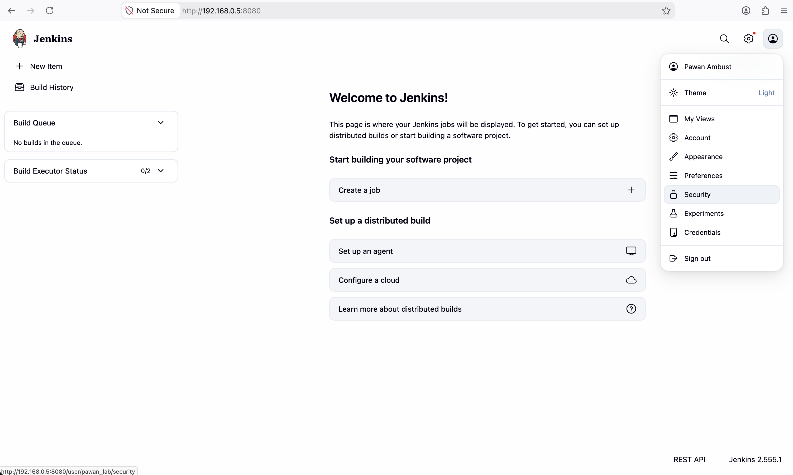
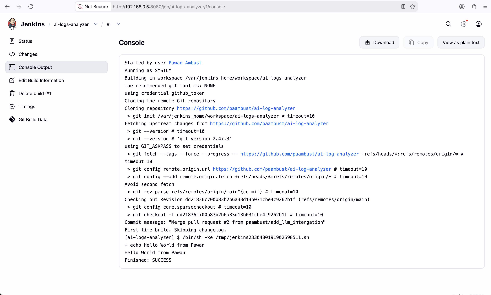

## Run Jenkins Instance on local machine as container
```
docker run -d -p 8080:8080 -p 50000:50000 --name jenkins-test -v jenkins_home:/var/jenkins_home jenkins/jenkins:lts
docker exec jenkins-test cat /var/jenkins_home/secrets/initialAdminPassword
3827d4072f5e4d0d862ef4214288034e
http://localhost:8080
```

# expose host docker daemon inside jenkins container to allow host doing the heavy lifting while building docker images
~ % docker run -d \
  --name jenkins-test \
  -p 8080:8080 \
  -v /var/run/docker.sock:/var/run/docker.sock \
  -v jenkins_home_lab:/var/jenkins_home \
  jenkins/jenkins:lts


# The first home page of Jenkins




# The first automated test iteration from Jenkins for the repository on Github
