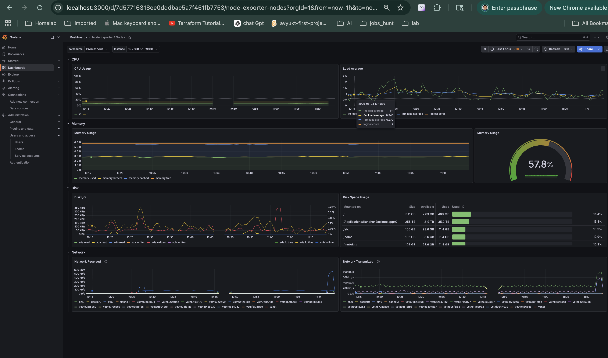
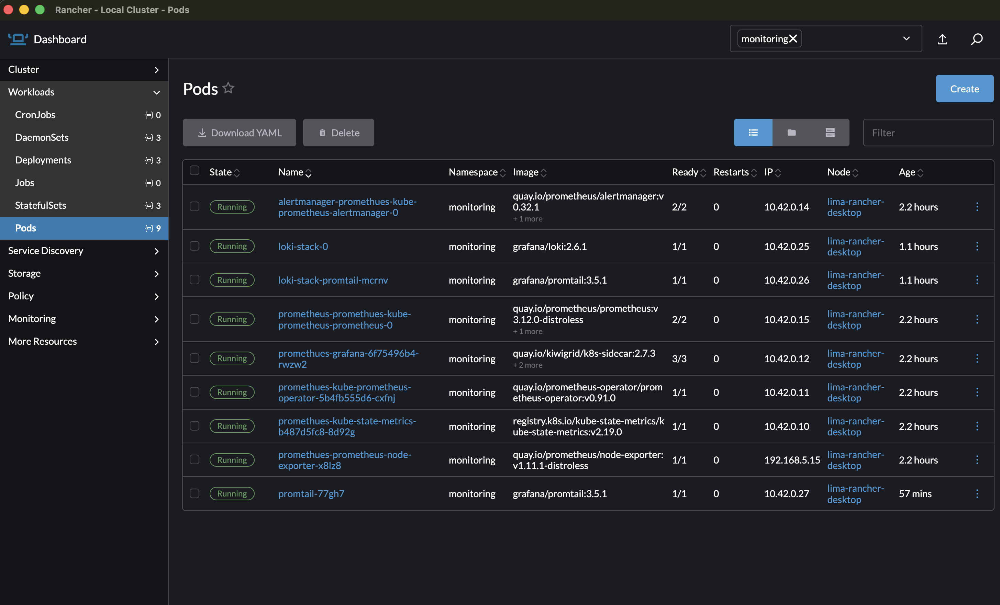
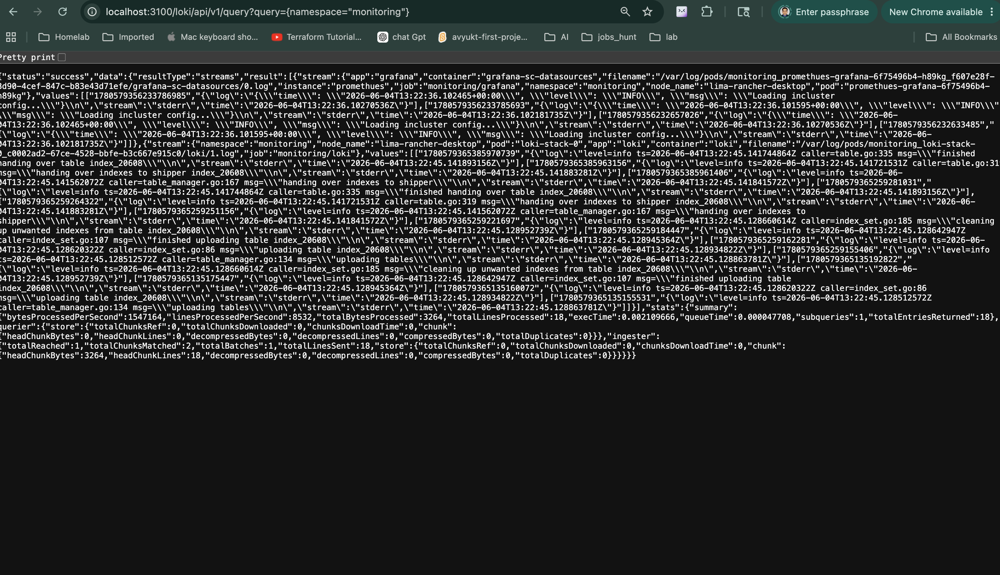
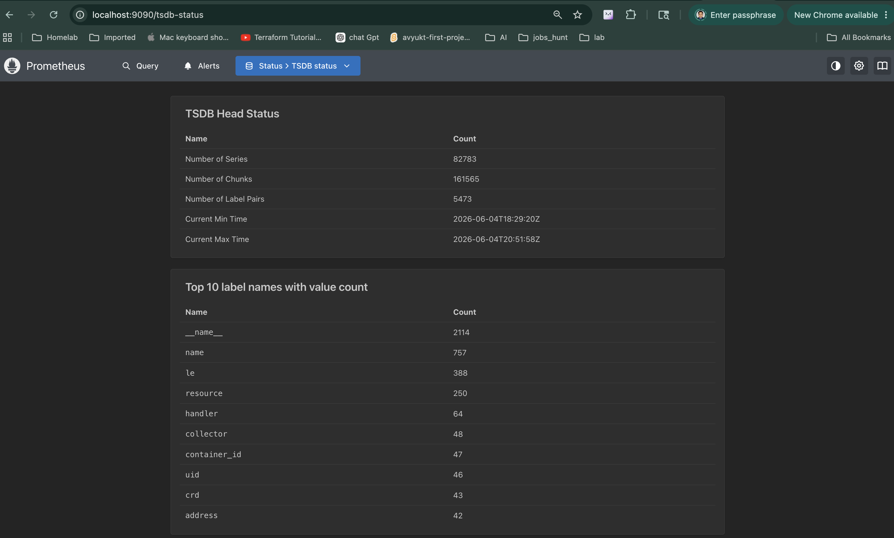

# Rancher Desktop + k3s Kubernetes Monitoring Setup

This repository provides a setup for monitoring a Kubernetes cluster using **Rancher Desktop + k3s** with **Prometheus**, **Grafana**, and **Loki**. This guide explains how to deploy and monitor your cluster using these tools.

---

## 🧠 Overview



This setup includes the following components:

| Component | Purpose |
|----------|---------|
| **Prometheus** | Scrapes metrics and stores TSDB data |
| **kube-state-metrics** | Converts Kubernetes objects into metrics |
| **node-exporter** | Collects node OS metrics (CPU, Memory, Disk, Network) |
| **Alertmanager** | Receives alerts from Prometheus and sends notifications |
| **Grafana** | Visualization UI for metrics and logs |
| **Loki** | Stores and indexes logs |
| **Promtail** | Reads Kubernetes container logs and pushes them to Loki |



---

## 📌 How to Deploy Rancher Desktop and k3s on Mac

### 1. Install Rancher Desktop

1. **Download Rancher Desktop** from [https://rancher.com/rancher-desktop/](https://rancher.com/rancher-desktop/).
2. Open the `.dmg` file and drag the Rancher Desktop app to your Applications folder.
3. Launch Rancher Desktop from your Applications folder.

### 2. Create a New Kubernetes Cluster

1. Open Rancher Desktop and click on the **"Create"** button.
2. Choose **"Kubernetes"** as the cluster type.
3. Select **"k3s"** as the Kubernetes distribution.
4. Choose a name for your cluster (e.g., `my-k3s-cluster`).
5. Click **"Create"** to start the cluster.

> 📝 **Note:** The k3s cluster will be created using a local Docker container. This is ideal for development and testing.

---

## 📦 Deploy Monitoring Stack

### 1. Deploy kube-prometheus-stack (Prometheus, Grafana, Loki, etc.)

1. Use Helm to deploy the **kube-prometheus-stack** chart:

```bash
helm repo add prometheus-community https://prometheus-community.github.io/helm-charts
helm repo update
helm install kube-prometheus-stack prometheus-community/kube-prometheus-stack \
  --namespace monitoring \
  --set grafana.enabled=true \
  --set loki.enabled=true \
  --set alertmanager.enabled=true
```

> ⚠️ **Note:** Make sure you have `helm` installed. If not, you can install it using `brew install helm`.

---

## 📝 Monitoring and Log Querying

### 1. Query Loki Logs

You can query logs from Loki using the following URL:

```
http://localhost:3100/loki/api/v1/query?query={namespace=%22monitoring%22}
```


You can also query logs from inside the cluster using:

```
http://loki-stack.monitoring.svc.cluster.local:3100/loki/api/v1/query_range
```

### 2. Example Python Code to Query Loki

```python
import requests

response = requests.get(
    "http://loki-stack:3100/loki/api/v1/query_range",
    params={"query": '{namespace="default"}'}
)
print(response.json())
```

```
{
    "status": "success",
    "data": {
        "resultType": "streams",
        "result": [
            {
                "stream": {
                    "job": "default/log-pod",
                    "namespace": "default",
                    "node_name": "lima-rancher-desktop",
                    "pod": "log-pod",
                    "app": "log-pod",
                    "container": "log-pod",
                    "filename": "/var/log/pods/default_log-pod_2c16d0c9-b942-413e-8c99-d96f64c0e05e/log-pod/0.log"
                },
                "values": [
                    [
                        "1780579885717855987",
                        "{\"log\":\"Thu Jun  4 13:31:25 UTC 2026 Hello from test pod\\n\",\"stream\":\"stdout\",\"time\":\"2026-06-04T13:31:25.608885779Z\"}"
                    ],
                    [
                        "1780579885710617904",
                        "{\"log\":\"Thu Jun  4 13:31:25 UTC 2026 Hello from test pod\\n\",\"stream\":\"stdout\",\"time\":\"2026-06-04T13:31:25.608885779Z\"}"
                    ],
                    [
                        "1780579880702484152",
                        "{\"log\":\"Thu Jun  4 13:31:20 UTC 2026 Hello from test pod\\n\",\"stream\":\"stdout\",\"time\":\"2026-06-04T13:31:20.605709735Z\"}"
                    ],
                    [
                        "1780579880697027193",
                        "{\"log\":\"Thu Jun  4 13:31:20 UTC 2026 Hello from test pod\\n\",\"stream\":\"stdout\",\"time\":\"2026-06-04T13:31:20.605709735Z\"}"
                    ],
                    [
                        "1780579875684666691",
                        "{\"log\":\"Thu Jun  4 13:31:15 UTC 2026 Hello from test pod\\n\",\"stream\":\"stdout\",\"time\":\"2026-06-04T13:31:15.603782649Z\"}"
                    ],
                    [
                        "1780579875684522316",
                        "{\"log\":\"Thu Jun  4 13:31:15 UTC 2026 Hello from test pod\\n\",\"stream\":\"stdout\",\"time\":\"2026-06-04T13:31:15.603782649Z\"}"
                    ],
                    [
                        "1780579870669104063",
                        "{\"log\":\"Thu Jun  4 13:31:10 UTC 2026 Hello from test pod\\n\",\"stream\":\"stdout\",\"time\":\"2026-06-04T13:31:10.600754313Z\"}"
                    ],
                    [
                        "1780579870669091438",
                        "{\"log\":\"Thu Jun  4 13:31:10 UTC 2026 Hello from test pod\\n\",\"stream\":\"stdout\",\"time\":\"2026-06-04T13:31:10.600754313Z\"}"
                    ],
                    [
                        "1780579865649128394",
                        "{\"log\":\"Thu Jun  4 13:31:05 UTC 2026 Hello from test pod\\n\",\"stream\":\"stdout\",\"time\":\"2026-06-04T13:31:05.599030186Z\"}"
                    ],
                    [
                        "1780579865647581269",
                        "{\"log\":\"Thu Jun  4 13:31:05 UTC 2026 Hello from test pod\\n\",\"stream\":\"stdout\",\"time\":\"2026-06-04T13:31:05.599030186Z\"}"
                    ],
                    [
                        "1780579860635354017",
                        "{\"log\":\"Thu Jun  4 13:31:00 UTC 2026 Hello from test pod\\n\",\"stream\":\"stdout\",\"time\":\"2026-06-04T13:31:00.594494017Z\"}"
                    ],
                    [
                        "1780579860635108392",
                        "{\"log\":\"Thu Jun  4 13:31:00 UTC 2026 Hello from test pod\\n\",\"stream\":\"stdout\",\"time\":\"2026-06-04T13:31:00.594494017Z\"}"
                    ]
                ]
            }
        ],
        "stats": {
            "summary": {
                "bytesProcessedPerSecond": 1195735,
                "linesProcessedPerSecond": 10133,
                "totalBytesProcessed": 1416,
                "totalLinesProcessed": 12,
                "execTime": 0.001184208,
                "queueTime": 0.000070917,
                "subqueries": 1,
                "totalEntriesReturned": 12
            },
            "querier": {
                "store": {
                    "totalChunksRef": 0,
                    "totalChunksDownloaded": 0,
                    "chunksDownloadTime": 0,
                    "chunk": {
                        "headChunkBytes": 0,
                        "headChunkLines": 0,
                        "decompressedBytes": 0,
                        "decompressedLines": 0,
                        "compressedBytes": 0,
                        "totalDuplicates": 0
                    }
                }
            },
            "ingester": {
                "totalReached": 1,
                "totalChunksMatched": 1,
                "totalBatches": 1,
                "totalLinesSent": 12,
                "store": {
                    "totalChunksRef": 0,
                    "totalChunksDownloaded": 0,
                    "chunksDownloadTime": 0,
                    "chunk": {
                        "headChunkBytes": 1416,
                        "headChunkLines": 12,
                        "decompressedBytes": 0,
                        "decompressedLines": 0,
                        "compressedBytes": 0,
                        "totalDuplicates": 0
                    }
                }
            }
        }
    }
}
```

---

## 📊 Prometheus Scrape Configuration

The Prometheus scrape configuration is dynamically generated by the **Prometheus Operator** from **ServiceMonitor**, **PodMonitor**, and **Prometheus CRDs**. The configuration is stored in the Secret `prometheus-promethues-kube-prometheus-prometheus`.

### 1. Inspect the Prometheus Configuration

```bash
kubectl get secret \
prometheus-promethues-kube-prometheus-prometheus \
-n monitoring -o jsonpath='{.data.prometheus\.yaml\.gz}' \
| base64 -d > prometheus.yaml.gz
gunzip prometheus.yaml.gz
cat prometheus.yaml
```

---

## 📌 Prometheus Targets

| Job | Purpose |
|-----|---------|
| `promethues-grafana` | Collect Grafana internal metrics (/metrics) |
| `promethues-kube-prometheus-alertmanager` | Collect Alertmanager metrics |
| `promethues-kube-prometheus-apiserver` | Collect Kubernetes API Server metrics |
| `promethues-kube-prometheus-coredns` | Collect CoreDNS metrics |
| `promethues-kube-prometheus-kube-controller-manager` | Collect Controller Manager metrics |
| `promethues-kube-prometheus-kube-etcd` | Collect etcd metrics |
| `promethues-kube-prometheus-kube-proxy` | Collect kube-proxy metrics |
| `promethues-kube-prometheus-kube-scheduler` | Collect Scheduler metrics |
| `promethues-kube-prometheus-kubelet` | Collect kubelet and cAdvisor metrics |
| `promethues-kube-prometheus-operator` | Collect Prometheus Operator metrics |
| `promethues-kube-prometheus-prometheus` | Collect Prometheus self-metrics |
| `promethues-kube-state-metrics` | Collect Kubernetes object metrics |
| `promethues-prometheus-node-exporter` | Collect node OS metrics (CPU, RAM, Disk, Network) |

---

## 📌 How to Expose New Pod Metrics to Prometheus

### 1. Example Application

If you have an application that exports metrics at `/metrics`, you can expose it to Prometheus by:

1. Creating a Service:
```yaml
apiVersion: v1
kind: Service
metadata:
  name: my-app
  labels:
    app: my-app
spec:
  selector:
    app: my-app
  ports:
  - port: 8080
```

2. Creating a ServiceMonitor:
```yaml
apiVersion: monitoring.coreos.com/v1
kind: ServiceMonitor
metadata:
  name: my-app
spec:
  selector:
    matchLabels:
      app: my-app
  endpoints:
  - port: http
    path: /metrics
```

3. Apply the files:
```bash
kubectl apply -f service.yaml
kubectl apply -f servicemonitor.yaml
```

---

## 📌 How Prometheus Discovers Targets

**Flow:**

```
Prometheus Operator
      │
      ▼
ServiceMonitor
      │
      ▼
Service
      │
      ▼
Pods
```

The Operator automatically updates the Prometheus configuration.

### 1. Verify ServiceMonitor
```bash
kubectl get servicemonitor -A
```

### 2. Query Prometheus
```bash
curl http://localhost:9090/api/v1/query?query=up{job=~".*my-app.*"}
```

---

## 📌 Accessing Grafana and Prometheus

### 1. Access Grafana
```bash
kubectl port-forward svc/promethues-grafana -n monitoring 3000:80
```

Then, navigate to `http://localhost:3000` in your browser.

### 2. Access Prometheus
```bash
kubectl port-forward svc/prometheus-promethues-kube-prometheus-prometheus-0 -n monitoring 9090:9090
```

Then, navigate to `http://localhost:9090` in your browser.

---

## 📌 Summary

This setup provides a complete monitoring solution for your Kubernetes cluster using **Rancher Desktop + k3s**. It includes:

- **Prometheus** for metrics collection
- **Grafana** for visualization
- **Loki** for log collection
- **Alertmanager** for alerting

You can now monitor your cluster, query logs, and set up alerts for any anomalies.

---
## Longer period data storage

Prometheus cannot directly write metrics into a GCS bucket and have Grafana query them efficiently. A bucket is object storage, not a time-series database.

Option : Prometheus + Thanos + GCS

This is the most common Kubernetes-native solution.

```
┌─────────────┐
│ Prometheus  │
└──────┬──────┘
       │
       ▼
┌─────────────┐
│ Thanos      │
│ Sidecar     │
└──────┬──────┘
       │
       ▼
┌─────────────┐
│ GCS Bucket  │
└─────────────┘

       ▲
       │
┌─────────────┐
│ Thanos      │
│ Store GW    │
└──────┬──────┘
       │
       ▼
┌─────────────┐
│ Thanos      │
│ Query       │
└──────┬──────┘
       │
       ▼
┌─────────────┐
│ Grafana     │
└─────────────┘
```
Option 2: Prometheus → Grafana Mimir

Grafana's modern solution.

Prometheus
    ↓ remote_write
Grafana Mimir
    ↓
GCS Bucket
    ↓
Grafana

Mimir stores blocks in GCS and indexes them.

Pros:

Massive scale
Multi-tenant
Grafana Labs supported

Cons:

More operationally complex

Used by many SaaS monitoring platforms.

Option 3: Prometheus → VictoriaMetrics

A favorite among many DevOps teams.

Prometheus
     ↓ remote_write
VictoriaMetrics
     ↓
GCS/S3 compatible storage
     ↓
Grafana

Pros:

Much simpler than Thanos
Excellent compression
Lower resource usage

Many Kubernetes operators choose VictoriaMetrics today because it is easier to run than a full Thanos stack.

What I would recommend for your background

Since you're already working with:

Kubernetes
Terraform
GCP
Observability

I'd choose:

Small/Medium Environment
Prometheus
     ↓
VictoriaMetrics
     ↓
Grafana

Simplest operationally.

Enterprise / Multi-cluster
Prometheus
     ↓
Thanos
     ↓
GCS
     ↓
Grafana

This is what you'll commonly encounter in larger organizations.


## High Cardinality

```
#Flask/Python example

from flask import Flask, request
from prometheus_client import Counter

http_requests_total = Counter(
    'http_requests_total',
    'Total HTTP requests',
    ['method', 'client_ip']  # label names defined here
)

@app.route('/api/users')
def get_users():
    client_ip = request.remote_addr  # ← gets IP from request
    
    http_requests_total.labels(
        method=request.method,
        client_ip=client_ip        # ❌ bad — passing IP as label
    ).inc()
    
    return jsonify(users)
```

```
# WRONG
http_requests_total.labels(
    client_ip="192.168.1.105"    # ❌ unique per client!
).inc()

# Creates:
http_requests_total{client_ip="192.168.1.1"}
http_requests_total{client_ip="192.168.1.2"}
http_requests_total{client_ip="10.0.0.45"}
# ... millions of IPs 💥

Fix:
python# Use region/zone instead
http_requests_total.labels(
    region="us-east"    # ✅ only a few regions
).inc()


http_requests_total = Counter(
    'http_requests_total',
    'Total HTTP requests',
    ['method', 'status', 'endpoint']   # ✅ low cardinality labels
)

@app.route('/api/users')
def get_users():
    http_requests_total.labels(
        method=request.method,         # GET/POST/PUT = 5 values
        status="200",                  # 200/400/500 = few values
        endpoint="/api/users"          # fixed route = few values
    ).inc()
```
Yes! Exactly Right 🎯
Each unique combination of label values creates its own time series in TSDB.

Visual Example
metric name + label combination = 1 time series in TSDB
# 1 metric, 3 labels = many combinations

http_requests_total{method="GET",  status="200", endpoint="/api/users"}  → 1 TSDB series
http_requests_total{method="GET",  status="404", endpoint="/api/users"}  → 1 TSDB series
http_requests_total{method="POST", status="200", endpoint="/api/users"}  → 1 TSDB series
http_requests_total{method="POST", status="500", endpoint="/api/users"}  → 1 TSDB series
http_requests_total{method="GET",  status="200", endpoint="/api/orders"} → 1 TSDB series
...

Cardinality Math
Total Series = all possible combinations of label values

method   = GET, POST, PUT, DELETE        → 4 values
status   = 200, 201, 400, 404, 500       → 5 values
endpoint = /api/users, /api/orders, ...  → 10 values

Total = 4 × 5 × 10 = 200 series ✅ fine


# Now add bad label:
user_id  = 1 million users               → 1,000,000 values

Total = 4 × 5 × 10 × 1,000,000 = 200,000,000 series 💥


Memory Impact
Each time series uses approximately 3KB of RAM in Prometheus

200 series       × 3KB = 600KB      ✅ fine
1,000,000 series × 3KB = 3GB RAM    ⚠️ heavy
200,000,000      × 3KB = 600GB RAM  💥 OOMKilled



Where Labels Are Defined — Full Picture
┌─────────────────────────────────────────────┐
│           WHERE LABELS COME FROM            │
│                                             │
│  1. APPLICATION CODE ← you control this     │
│     method, status, endpoint, error_type    │
│                                             │
│  2. PROMETHEUS CONFIG ← auto added          │
│     job, instance                           │
│                                             │
│  3. KUBERNETES (kube-state-metrics)         │
│     pod, namespace, node, container         │
│                                             │
│  4. THANOS EXTERNAL LABELS                  │
│     cluster, region, environment            │
└─────────────────────────────────────────────┘

Key Takeaway

The developer instrumenting the application is responsible for choosing good labels — this is why monitoring best practices should be part of your development guidelines, not an afterthought.

Bad labeling decisions made at code level can bring down Prometheus in production! 🚨Sonnet 4.6 Low

## 📌 Contributing

If you'd like to improve this README or add more details, feel free to submit a pull request or open an issue.

---

## 📌 License

This project is licensed under the MIT License - see the [LICENSE](LICENSE) file for details.